<div align="center">

# Ahmad Jamil Dhami | Founder & CEO, ZehanX Technologies


</div>

<div align="center">
  
</div>

---

## Professional Overview

<table>
<tr>
<td width="50%">

### About Me
```javascript
const ahmadJamilDhami = {
    role: "Founder & CEO",
    company: "ZehanX Technologies",
    location: "Pakistan",
    specialization: ["AI/ML", "Quantum Computing", "Web Development"],
    experience: "Full-Stack Web Developer",
    followers: "Growing Developer Community",
    mission: "Advancing Pakistan's tech ecosystem",
    vision: "Leading innovation in AI and web technologies"
};
```

</td>
<td width="50%">

### Current Focus
- **Leading ZehanX Technologies**
- **AI & Quantum Computing Research**
- **Advanced Web Development Solutions**
- **Reinforcement Learning Applications**
- **Machine Learning Model Development**
- **AI Gaming & Interactive Systems**

</td>
</tr>
</table>

---

## GitHub Analytics & Performance

<div align="center">
  


</div>

<div align="center">
  


</div>

<div align="center">
  
[](https://github.com/Ahmadjamil888)
[](https://github.com/Ahmadjamil888)
[](https://github.com/Ahmadjamil888)

</div>

---

## Technology Stack & Expertise

<div align="center">

### AI & Machine Learning

<br/>


### Web Development

<br/>


### Design & Tools

<br/>


### Cloud & DevOps

<br/>


</div>

---

## Featured Projects Portfolio

<div align="center">

### Flappy Bird AI - Reinforcement Learning Model
<table>
<tr>
<td width="60%">

**Advanced reinforcement learning implementation**
- **Q-Learning algorithm** for autonomous gameplay
- **Real-time decision making** and strategy optimization
- **Performance analytics** and learning visualization
- **Ready-to-play trained model** with high accuracy
- **Continuous learning** and adaptation capabilities

**Tech Stack:** Python, TensorFlow, OpenAI Gym, Reinforcement Learning

[Repository](https://github.com/Ahmadjamil888/Flappy-Bird_AI)

</td>
<td width="40%">


</td>
</tr>
</table>

---

### ZehanX Technologies Website
<table>
<tr>
<td width="40%">


</td>
<td width="60%">

**Advanced company website with AI integration**
- **Futuristic design** with Framer Motion animations
- **AI-powered features** and interactive elements
- **Responsive design** across all devices
- **High performance** and optimized loading
- **Professional business presentation**

**Tech Stack:** TypeScript, Next.js, Framer Motion, TailwindCSS

[Live Site](https://zehanxtech.com) | [Repository](https://github.com/Ahmadjamil888/ADVANCED_WEBSITE_DESIGN)

</td>
</tr>
</table>

---

### Custom LLM Tokenizer
<table>
<tr>
<td width="60%">

**Advanced data preprocessing and tokenization tool**
- **Automated data transformation** from faulty to clean datasets
- **One-click preprocessing** for machine learning models
- **Data analysis** and quality assessment tools
- **Batch processing** capabilities for large datasets
- **Multiple export formats** for various ML frameworks

**Tech Stack:** Python, Pandas, NumPy, Data Processing Libraries

[Repository](https://github.com/Ahmadjamil888/CUSTOM_LLM_TOKENIZER)

</td>
<td width="40%">


</td>
</tr>
</table>

---

### AI Interviewer MVP
<table>
<tr>
<td width="40%">


</td>
<td width="60%">

**Intelligent interview automation platform**
- **AI-powered interview** conduct and evaluation
- **Secure API key** authentication system
- **Comprehensive candidate** assessment and scoring
- **SaaS-ready architecture** for scalable deployment
- **Analytics dashboard** for interview insights

**Tech Stack:** TypeScript, Next.js, AI APIs, Authentication

[Repository](https://github.com/Ahmadjamil888/AI_INTERVIEWER_MVP)

</td>
</tr>
</table>

---

### Chess Game AI
<table>
<tr>
<td width="60%">

**Advanced chess engine with machine learning**
- **Strategic gameplay** with minimax algorithm
- **Machine learning** position evaluation
- **Move prediction** and game analysis
- **Multiple difficulty levels** for various skill levels
- **Interactive interface** with real-time feedback

**Tech Stack:** Python, Machine Learning Algorithms, Game Theory

[Repository](https://github.com/Ahmadjamil888/CHESS_GAME_AI)

</td>
<td width="40%">


</td>
</tr>
</table>

</div>

---

## AI/ML Specializations & Deep Learning Expertise

<div align="center">

<table>
<tr>
<td width="33%">

### Machine Learning


**Core Algorithms:**
- **KNN** (K-Nearest Neighbors)
- **Random Forest & Decision Trees**
- **SVM** (Support Vector Machines)
- **Linear/Logistic Regression**
- **Naive Bayes & Clustering**

</td>
<td width="33%">

### Deep Learning


**Neural Networks:**
- **RNN** (Recurrent Neural Networks)
- **CNN** (Convolutional Neural Networks)
- **GRU** (Gated Recurrent Units)
- **LSTM** (Long Short-Term Memory)
- **GANs** (Generative Adversarial Networks)

</td>
<td width="33%">

### Data Science


**Analytics & Visualization:**
- **EDA** (Exploratory Data Analysis)
- **Statistical Modeling**
- **Data Visualization** (Matplotlib, Seaborn)
- **Feature Engineering**
- **Time Series Analysis**

</td>
</tr>
</table>

</div>

---

## Skills Proficiency Matrix

```mermaid
graph TD
    A[Ahmad Jamil - Full Stack Engineer] --> B[AI/ML Expertise]
    A --> C[Web Development]
    A --> D[Data Science]
    A --> E[Cloud & DevOps]
    
    B --> B1[Deep Learning - 95%]
    B --> B2[Machine Learning - 98%]
    B --> B3[Computer Vision - 90%]
    B --> B4[NLP - 85%]
    
    C --> C1[React/Next.js - 95%]
    C --> C2[Laravel/PHP - 90%]
    C --> C3[Node.js - 88%]
    C --> C4[TypeScript - 92%]
    
    D --> D1[Python/Pandas - 96%]
    D --> D2[NumPy/SciPy - 94%]
    D --> D3[Data Visualization - 90%]
    D --> D4[Statistical Analysis - 88%]
    
    E --> E1[AWS Services - 85%]
    E --> E2[Docker/Kubernetes - 80%]
    E --> E3[CI/CD Pipelines - 82%]
    E --> E4[Cloud Architecture - 87%]
```

<div align="center">



</div>

---

## Design & Development Tools Mastery

<div align="center">

<table>
<tr>
<td width="25%">

### Design Tools


- **Figma** - UI/UX Design
- **Canva** - Graphics & Marketing
- **Adobe Creative Suite**
- **Sketch** - Interface Design

</td>
<td width="25%">

### Web Platforms


- **WordPress** - CMS Development
- **Shopify** - E-commerce Solutions
- **Webflow** - No-code Development
- **Squarespace** - Website Building

</td>
<td width="25%">

### Data Analysis


- **Pandas** - Data Manipulation
- **NumPy** - Numerical Computing
- **Matplotlib/Seaborn** - Visualization
- **Plotly** - Interactive Charts

</td>
<td width="25%">

### Cloud Services


- **AWS** - Cloud Infrastructure
- **Firebase** - Backend Services
- **Vercel** - Deployment Platform
- **Docker** - Containerization

</td>
</tr>
</table>

</div>

---

## ZehanX Technologies

As Founder and CEO of ZehanX Technologies, I lead a forward-thinking company specializing in AI-driven web development solutions. Our mission is to bridge the gap between cutting-edge artificial intelligence and practical web applications, serving clients across Pakistan and internationally.

**Company Focus Areas:**
- AI Integration Services
- Full-Stack Web Development
- Data Science Consulting
- Custom Software Solutions
- Digital Transformation

---

## Repository Statistics

With **54 public repositories** and a growing community of followers, my GitHub showcases a diverse range of projects spanning:

- **AI & Machine Learning:** 15+ repositories
- **Web Development:** 20+ repositories  
- **Data Science:** 10+ repositories
- **Gaming & Interactive:** 5+ repositories
- **Tools & Utilities:** 4+ repositories

---

## Professional Contact Information

**Ahmad Jamil Dhami**  
Founder & CEO, ZehanX Technologies

- **Personal Portfolio:** [ahmad-site-three.vercel.app](https://ahmad-site-three.vercel.app/)
- **Company Website:** [zehanxtech.com](https://zehanxtech.com)
- **Email:** shazabjamildhami@gmail.com
- **GitHub:** [@Ahmadjamil888](https://github.com/Ahmadjamil888)
- **Location:** Pakistan
- **upwork:** [Ahmad jamil Dhami](https://www.upwork.com/freelancers/~01785c13a04c9505c6)

---

<div align="center">

**"Welcome to my GitHub. I work in web development and advanced computing."**

*Building the future of technology, one project at a time.*

</div>
