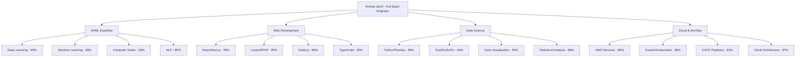

<div align="center">

# Ahmad Jamil | Entrepreneur, Machine learning engineer

</div>


---

## Professional Overview

<table>
<tr>
<td width="50%">

### About Me
```javascript
const ahmadJamilDhami = {
    location: "Pakistan",
    specialization: ["AI/ML", "Quantum Computing", "Web Development"],
    experience: "AI/ML engineer, software engineer",
    followers: "Growing Developer Community",
    mission: "Advancing Pakistan's tech ecosystem",
    vision: "Leading innovation in AI and web technologies"
};
```

</td>

</tr>
</table>

---

## GitHub Analytics & Performance

<div align="center">
  


</div>

<div align="center">
  


</div>

<div align="center">
  
[](https://github.com/Ahmadjamil888)
[](https://github.com/Ahmadjamil888)
[](https://github.com/Ahmadjamil888)

</div>

---

## Technology Stack & Expertise

<div align="center">

### AI & Machine Learning

<br/>


### Web Development

<br/>


### Design & Tools

<br/>


### Cloud & DevOps

<br/>


</div>

---


## AI/ML Specializations & Deep Learning Expertise

<div align="center">

<table>
<tr>
<td width="33%">

### Machine Learning


**Core Algorithms:**
- **KNN** (K-Nearest Neighbors)
- **Random Forest & Decision Trees**
- **SVM** (Support Vector Machines)
- **Linear/Logistic Regression**
- **Naive Bayes & Clustering**

</td>
<td width="33%">

### Deep Learning


**Neural Networks:**
- **RNN** (Recurrent Neural Networks)
- **CNN** (Convolutional Neural Networks)
- **GRU** (Gated Recurrent Units)
- **LSTM** (Long Short-Term Memory)
- **GANs** (Generative Adversarial Networks)

</td>
<td width="33%">

### Data Science


**Analytics & Visualization:**
- **EDA** (Exploratory Data Analysis)
- **Statistical Modeling**
- **Data Visualization** (Matplotlib, Seaborn)
- **Feature Engineering**
- **Time Series Analysis**

</td>
</tr>
</table>

</div>

---

## Skills Proficiency Matrix

<div align="center">


```mermaid
graph TD
    A[Ahmad Jamil - Full Stack Engineer] --> B[AI/ML Expertise]
    A --> C[Web Development]
    A --> D[Data Science]
    A --> E[Cloud & DevOps]
    
    B --> B1[Deep Learning - 95%]
    B --> B2[Machine Learning - 98%]
    B --> B3[Computer Vision - 90%]
    B --> B4[NLP - 85%]
    
    C --> C1[React/Next.js - 95%]
    C --> C2[Laravel/PHP - 90%]
    C --> C3[Node.js - 88%]
    C --> C4[TypeScript - 92%]
    
    D --> D1[Python/Pandas - 96%]
    D --> D2[NumPy/SciPy - 94%]
    D --> D3[Data Visualization - 90%]
    D --> D4[Statistical Analysis - 88%]
    
    E --> E1[AWS Services - 85%]
    E --> E2[Docker/Kubernetes - 80%]
    E --> E3[CI/CD Pipelines - 82%]
    E --> E4[Cloud Architecture - 87%]
```

</div>

---

## Design & Development Tools Mastery

<div align="center">

<table>
<tr>
<td width="25%">

### Design Tools


- **Figma** - UI/UX Design
- **Canva** - Graphics & Marketing
- **Adobe Creative Suite**
- **Sketch** - Interface Design

</td>
<td width="25%">

### Web Platforms


- **WordPress** - CMS Development
- **Shopify** - E-commerce Solutions
- **Webflow** - No-code Development
- **Squarespace** - Website Building

</td>
<td width="25%">

### Data Analysis


- **Pandas** - Data Manipulation
- **NumPy** - Numerical Computing
- **Matplotlib/Seaborn** - Visualization
- **Plotly** - Interactive Charts

</td>
<td width="25%">

### Cloud Services


- **AWS** - Cloud Infrastructure
- **Firebase** - Backend Services
- **Vercel** - Deployment Platform
- **Docker** - Containerization

</td>
</tr>
</table>

</div>

---

## ZehanX Technologies

As Founder and CEO of ZehanX Technologies, I lead a forward-thinking company specializing in AI-driven web development solutions. Our mission is to bridge the gap between cutting-edge artificial intelligence and practical web applications, serving clients across Pakistan and internationally.

**Company Focus Areas:**
- AI Integration Services
- Full-Stack Web Development
- Data Science Consulting
- Custom Software Solutions
- Digital Transformation

---

## Professional Contact Information

**Ahmad Jamil Dhami**  
Founder & CEO, ZehanX Technologies

- **Email:** ahmadjamildhami@gmail.com
- **Instagram:** [@ahmadjamil.official]([https://github.com/Ahmadjamil888](https://www.instagram.com/ahmadjamil.official/))
- **Location:** Pakistan


---

<div align="center">

**"Welcome to my GitHub. I work in web development and advanced computing."**

*Building the future of technology, one project at a time.*

</div>
